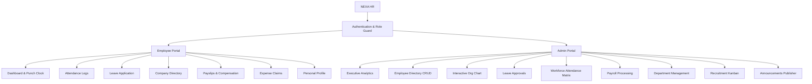

# ⚡ NEXA HR — Enterprise Human Resource Management System (HRMS)

[](https://reactjs.org/)
[](https://vitejs.dev/)
[](https://reactrouter.com/)
[](LICENSE)
[](https://github.com)

> **NEXA HR** is a modern, responsive, full-featured Human Resource Management System (HRMS) built with React and Vite. It provides a dual-portal architecture featuring an **Employee Self-Service (ESS)** workspace and an **Admin / HR Operations** control center, complete with attendance punching, leave workflows, org hierarchy charts, payroll processing, and dark mode.

---

## 📑 Table of Contents

- [✨ Key Features](#-key-features)
  - [👤 Employee Self-Service (ESS) Portal](#-employee-self-service-ess-portal)
  - [🛡️ Admin & HR Operations Portal](#️-admin--hr-operations-portal)
  - [🎨 Design & UX Highlights](#-design--ux-highlights)
- [🛠️ Tech Stack](#️-tech-stack)
- [🚀 Quick Start](#-quick-start)
- [🔑 Demo Credentials](#-demo-credentials)
- [📂 Project Structure](#-project-structure)
- [📊 Included Modules](#-included-modules)
- [💾 Data Persistence](#-data-persistence)
- [📜 Scripts](#-scripts)
- [🤝 Contributing](#-contributing)
- [📄 License](#-license)

---

## ✨ Key Features

### 👤 Employee Self-Service (ESS) Portal
- **Interactive Dashboard**: Live attendance punch tracker, real-time work timer, pending request badges, quick action triggers, and corporate announcements.
- **Attendance & Time Tracking**: One-click check-in and check-out with timestamps, monthly attendance logs, and status indicators.
- **Leave Management**: View categorized leave balances (Casual, Sick, Earned), apply for leaves with date-pickers and reasons, and track status (`Pending`, `Approved`, `Rejected`).
- **Employee Directory**: Searchable company directory with department filters, contact cards, and detailed employee profile modals.
- **Interactive Payslips**: View and download itemized monthly salary breakdowns including earnings, statutory deductions, gross pay, and net pay.
- **Expense Claims**: Submit reimbursement claims with expense types, amounts, and receipts with real-time status tracking.
- **Profile Management**: Update personal info, emergency contacts, job designations, and banking credentials.
- **Additional Tools**: Company holiday calendar, timesheet tracking, performance goals/OKRs, HR support requests, and onboarding checklist.

### 🛡️ Admin & HR Operations Portal
- **Executive Analytics Dashboard**: High-level KPIs (Total Headcount, Active Staff, Departments, Pending Actions) paired with Recharts visualizations for departmental distributions and workforce metrics.
- **Employee Management (CRUD)**: Filter, search, add, edit, and activate/deactivate employees across 60+ pre-seeded employee records and 6 organizational departments.
- **Interactive Org Chart**: Dynamic, collapsible organizational hierarchy tree mapping the reporting structure from Executive Director down to Department Managers and team members.
- **Leave Approval Center**: Centralized inbox for reviewing employee leave requests with instant one-click approval or rejection.
- **Workforce Attendance Matrix**: Monitor company-wide daily attendance logs, punctuality records, and department-level attendance trends.
- **Payroll Management**: Departmental payroll expenditure tracker, salary disbursement controls, and payslip generation.
- **Department Administration**: View team headcounts, create departments, and designate department heads.
- **Recruitment Pipeline**: Visual Kanban board to track candidates through screening, interviewing, offers, and hiring stages.
- **Announcements Engine**: Broadcast corporate news, policy changes, and events to all employees.

### 🎨 Design & UX Highlights
- **🌙 Persistent Dark / Light Mode**: Seamless theme switching with color tokens preserved in `localStorage`.
- **📱 Fully Responsive**: Optimized layouts for desktops, tablets, and mobile screens with a collapsible sidebar and mobile drawer.
- **🔔 Toast Notification System**: Instant user feedback for check-ins, leave submissions, status approvals, and data saves.
- **⚡ Zero Configuration Backend**: Operates client-side with full data persistence using browser `localStorage`.

---

## 🛠️ Tech Stack

| Layer | Technology |
|---|---|
| **Frontend Framework** | [React 18+](https://reactjs.org/) |
| **Build Tooling & Dev Server** | [Vite](https://vitejs.dev/) |
| **Client-Side Routing** | [React Router v6](https://reactrouter.com/) |
| **Icons** | [Lucide React](https://lucide.dev/) |
| **Charts & Data Visualization** | [Recharts](https://recharts.org/) |
| **Styling & Theming** | Pure CSS3 Variables & Design Tokens (Dark/Light mode) |
| **Typography** | Inter (Google Fonts) |

---

## 🚀 Quick Start

### Prerequisites
Make sure you have **Node.js (v18 or higher)** and **npm** installed on your machine.

### Installation

1. **Clone the repository:**
   ```bash
   git clone https://github.com/dhanush-chanchali/-nexa-HR-INTELLIGENT-HR-WORKFORCE-PLATFORM.git
   cd -nexa-HR-INTELLIGENT-HR-WORKFORCE-PLATFORM
   ```

2. **Install dependencies:**
   ```bash
   npm install
   ```

3. **Start the local development server:**
   ```bash
   npm run dev
   ```

4. **Open in browser:**
   Navigate to `http://localhost:5173` (or the URL shown in your terminal).

---

## 🔑 Demo Credentials

You can use the one-click demo login buttons on the sign-in screen, or manually enter:

| Role | Email | Password | Access Scope |
|---|---|---|---|
| **Admin / HR Manager** | `admin@demo.com` | `demo123` | Full workforce management, approvals, analytics, org chart, payroll |
| **Employee** | `employee@demo.com` | `demo123` | Personal dashboard, attendance punching, leave applying, payslips |

---

## 📂 Project Structure

```text
nexa-hr/
├── index.html              # HTML entry point with Inter font & viewport meta
├── package.json            # Scripts & project dependencies
├── vite.config.js          # Vite configuration
└── src/
    ├── main.jsx            # Core application router, state management, & views
    └── styles.css          # Design system tokens, layouts, cards, & dark mode theme
```

---

## 📊 Included Modules



---

## 💾 Data Persistence

This prototype uses a client-side mock store powered by `window.localStorage`. Actions persist between page refreshes and browser sessions:
- Active authenticated session & selected role
- Dark / Light theme preference
- Attendance check-in / check-out times
- Submitted leave requests & approval states
- Newly added or modified employee records
- Expense claims & announcements

To reset back to default seed data, simply clear your browser's `localStorage` for `localhost:5173`.

---

## 📜 Scripts

| Command | Description |
|---|---|
| `npm run dev` | Starts Vite development server at `http://localhost:5173` |
| `npm run build` | Compiles production assets into `dist/` |
| `npm run preview` | Locally serves the production build for testing |

---

## 🤝 Contributing

Contributions, issues, and feature requests are welcome!
1. Fork the Project
2. Create your Feature Branch (`git checkout -b feature/AmazingFeature`)
3. Commit your Changes (`git commit -m 'Add some AmazingFeature'`)
4. Push to the Branch (`git push origin feature/AmazingFeature`)
5. Open a Pull Request

---

## 📄 License

This project is licensed under the **MIT License** — feel free to use it for personal, commercial, or educational projects.
